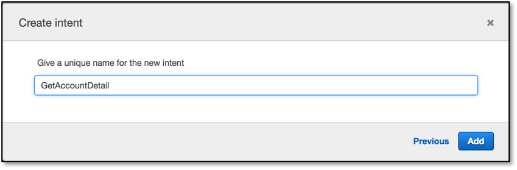
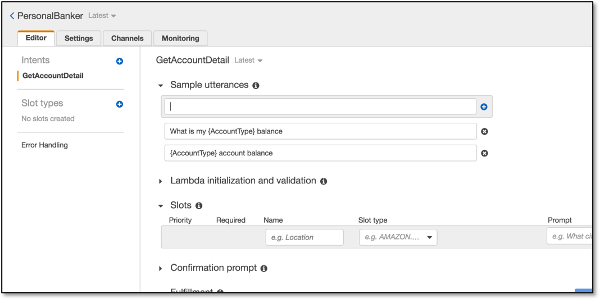
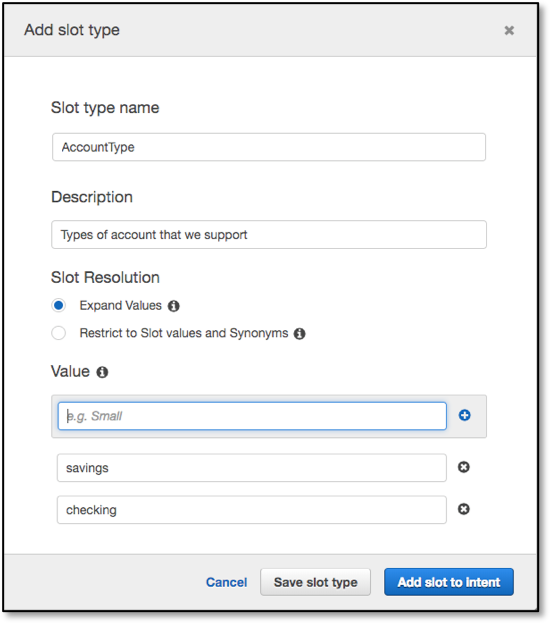
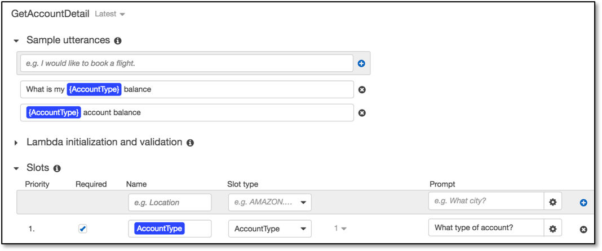
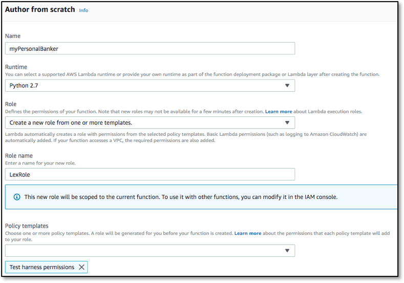

    
**Last Updated:** December 2018
# Building Chatbots with Amazon Lex

## Overview

Amazon Lex is a service for building conversational interfaces into any application using voice and text. Amazon Lex provides the advanced deep learning functionalities of automatic speech recognition (ASR) for converting speech to text, and natural language understanding (NLU) to recognize the intent of the text, to enable you to build applications with highly engaging user experiences and lifelike conversational interactions. With Amazon Lex, the same deep learning technologies that power Amazon Alexa are now available to any developer, enabling you to quickly and easily build sophisticated, natural language, conversational bots (&quot;chatbots&quot;). This lab is designed to demonstrate how to create a new bot including defining intents and slots. This lab will walk you through the following:

- Creating a Lex bot
- Adding intents
- Adding slot types
- Using AWS Lambda as the back-end logic for Lex

# Create the bot

1. Log in to the [AWS console](https://console.aws.amazon.com/lex/home) and navigate to the Amazon Lex service
2. If you have never created a bot, click &quot;Get Started&quot;
3. Choose &quot;Custom bot&quot;, which will display a dialog asking you to defined your bot
4. Our bot name will be &quot;PersonalBanker&quot;
5. Choose your preferred output voice
6. Session timeout should be 5 minute
7. Choose &quot;No&quot; to the Children&#39;s Online Privacy Protection Act (COPPA) question

The form should now look as follows, noting that we&#39;re going to accept the default IAM role.

8. Click &quot;Create&quot;
9. We will start by creating an intent, which represents an action that the user wants to perform. For example, we&#39;re going to create three intents in this lab for different actions a user can perform: Get Account Details; Get Loan Details; Get Loan Products.  Click the &quot;Create Intent&quot; button.
10. In the window that pops-up click the &quot;Create intent&quot; link

11. Our first intent enables the user to get account details, so name this intent &quot;GetAccountDetail&quot; then click &quot;Add&quot;.

12. We now want to provide samples of what our user would type or say to perform this action (i.e. to activate this intent). Under &quot;Sample utterances&quot;, type the below phrases and hit [enter] or click the blue &quot;+&quot; sign after each phrase. Make sure you do not add a question mark at the end of the phrase as this will cause build issues later on.

- _What is my {AccountType} balance_
- _{AccountType} account balance_

**NOTE** : {AccountType} represents a &#39;slot&#39; which is information that we need to process the users request. Type it exactly as shown above with the braces, and in the next step we will define the &#39;AccountType&#39; slot and list the acceptable values (checking, savings). Once the lab is complete, the user will interact with our bot by saying something like &quot;What is my checking balance&quot;.

13. Next we define a slot which is information we need to process the users request. This information can be included in the utterance (query) that the user types or says, and if not included, Lex will prompt the user for the information. While Lex includes many built-in slot types (such as number, colour, city, food, etc), in this case we want to define a custom slot to get the account type that the user is referring to.

	Click on the blue &quot;+&quot; sign next to &quot;Slot types&quot; on the left hand side of the screen and select the &quot;Create slot type&quot; link

14. For &#39;Slot type name&#39; enter &quot;AccountType&quot; and optionally enter a description (although description is not required)
15. For Value, we want to allow the user to make queries against either their &quot;checking&quot; or &quot;savings&quot; account so enter those as values, clicking the blue &quot;+&quot; sign after each word.

16. Click &quot;Add slot to intent&quot;
17. Now that have defined what the user is going to ask via an utterance, and also defined our customer &quot;vocabularly&quot; via a slot type, we now have to additionally link the slot types to the intent with additional information such as whether it is required or not an the prompt to use if Lex has ask the user to provide it.

	In the existing Slot list cange the &quot;Name&quot; field from &quot;slotOne&quot; to &quot;AccountType&quot; so that it matches the slot name that we specified when we created the sample utterences – note that these do not have to match, but this example will be clearer if we keep them the same.

18. Specify &quot;What type of account?&quot; for the &quot;Prompt&quot; field. This prompt will be used by our bot if the user does not specify an account type when asking a question.

19. Scroll down and click &quot;Save Intent&quot;

If at any point you made a mistake in the steps above, selecting the &quot;Latest&quot; version of the intent at the top, next to the intent name, will allow you to edit your choices.

20. Let&#39;s build this simple Bot: Hit the grey Build button at the top right corner. You will be asked for confirmation to build. Click &quot;Build&quot;.

The build process takes approximately a minute. Once complete, you can ask your bot a question as a way to test it. For example, you could type &quot;What is my checking balance?&quot; in the chat window, or click the microphone symbol, speak your request and client it again to have Lex translate your speech to text. At this stage since we have not added in the backend Lambda function, the response will be that the bot is ready for fulfillment.

Let&#39;s add 2 more intents and one more slot type.

21. Click the blue &quot;+&quot; sign next to &quot;Intents&quot; on the left hand side of the page, then click &quot;Create intent&quot;.
22. This intent will allow users to get information on their outstanding home or car loan balance, so set the name to &quot;GetLoanDetail&quot; then click &quot;Add&quot;
23. For sample utterences (the things we expect out users to type/say to our bot to trigger a specific intent/action), add the following phrase then click the blue &quot;+&quot; at the end of the sample utterance box.
  - &quot;Get my {LoanType} loan balance&quot;
24. Now we&#39;ll create a new slot type which we&#39;ll use to store a response from the user as to whether they are wanting the intent to access their _car_ loan balance or their _home_ loan balance. Click the blue &quot;+&quot; sign next to &#39;Slot types&#39; on the left hand side of the screen
  - For &#39;Slot type name&#39; enter &quot;LoanType&quot; and optionally provide a description
  - Enter the following two options as values:
    - car
    - home

25. Click &quot;Add slot to intent&quot;
26. Change the name of the slot on the intent detail screen from &quot;slotOne&quot; to &quot;LoanType&quot;
27. Provide a prompt (such as &quot;Which loan account?&quot;)
28. Make sure that the &quot;Required&quot; column is selected

29. Click &#39;Save Intent&#39;

Now we&#39;ll add a final intent to allow users to get more information on the loan products that we have.

30. Click the blue &quot;+&quot; sign next to &quot;Intents&quot; on the left hand side of the page, then click &quot;Create new intent&quot;.
31. Set the name of the intent to &quot;GetLoanProducts&quot; then click &#39;Add&#39;
32. For sample utterences (the things we expect our users to type/say to our bot to trigger a specific intent/action), add the following two phrases. Make sure **not** to include punctuation (such as comma&#39;s or question marks).

  - &quot;What is the rate on the {LoanType} loan&quot;
  - &quot;More loan info&quot;

	The &quot;More loan info&quot; utterance will be used as a follow-up after a user has asked for information on their outstanding loan balance.  We&#39;re not going to create a new slot type for this intent, as we&#39;re going to re-use the LoanType slot from the intent that we defined previously.

33. As we haven&#39;t defined a new slot type for this intent there isn&#39;t a slot entry yet under on the intent detail panel.  Enter the following values into the empty slot line:
  - Name: LoanType
  - Slot Type: LoanType (select from the drop-down list)
  - Prompt: Which loan type?
34. Click the blue &quot;+&quot; button to the right of the Slots information to add this slot to the intent

35. Click &#39;Save Intent&#39;
36. Click Build, and click Build again when prompted for confirmation.

Our bot is almost ready, and you can test it like before with the new utterances, but it is still quite dumb – all it needs now is a smart backend.

# Create a Lambda function

Here we will create a Lambda function that has some Python code to detect the intent name (&#39;GetAccountDetail&#39;, &#39;GetLoanDetail&#39; or &#39;GetLoanProducts&#39;) and to return static values based on the AccountType (checking, saving) or LoanType (car, home) included in the intent. In a real world example we would have already authenticated the user and would write Python code to do a database lookup for the account balances.

1. Use the AWS Console to navigate to Lambda.
2. Click on the orange &#39;Create a function&#39; link under the &#39;Getting Started&#39; section
3. On the &quot;Create function&quot; page, click the &quot;Author from scratch&quot; button
4. Let&#39;s give our function the name of &quot;myPersonalBanker&quot; and optionally provide a description
5. Choose Python 2.7 as the Runtime
6. We will &quot;Create new role from template – give it a Lex-style role name (such as &quot;LexRole&quot;) and select &quot;Test Harness permissions&quot; as the policy template.

7. Hit &quot;Create function&quot; on the bottom right and you&#39;ll be take to the &quot;Configuration&quot; window.  We are not adding any additional triggers, nor are we using Lambda Layers, so scroll down to the &quot;Function code&quot; section
8. Open the lambda function code you will find [here](https://github.com/drandrewkane/AI_ML_Workshops/blob/master/lab-2-Building_Chat_Bots_With_Lex/myPersonalBanker_v1.py) (myPersonalBanker\_v1.py). Copy and paste the code into the inline editor – make sure that you overwrite any template code that is already in the code box
9. Scroll down to the &#39;&quot;Execution role&quot; section and ensure that the role you created previously is selected in the &quot;Existing role&quot; drop-down – if not then please select it
10. Leave the rest unchanged, then hit the orange &quot;Save&quot; button at the top of the screen

# Link the bot with the Lambda function

In this step we will link the three intents we created to the Lambda function. We do this by providing the Lambda function as the method that contains the business logic used to &#39;fulfill&#39; the users requests. Once this is done (and the bot rebuilt), when a user specifies an intent (such as &#39;what is my checking account balance&#39;), Lex will call our Lambda function and pass it the intent name (&#39;GetAccountDetail&#39;) and the slot value (&#39;checking&#39;).

To do this, we go back to the [Lex Console](https://console.aws.amazon.com/lex).

1. Click on Personal Banker
2. Enure the &#39;GetAccountDetail&#39; intent is selected
3. Make sure that the &#39;Latest&#39; version is selected for both the bot and the intent

4. Scroll down to &quot;Fulfillment&quot;, select &quot;AWS Lambda function&quot;, choose &quot;myPersonalBanker&quot; and click &quot;OK&quot; in the popup warning window which opens. It indicates you are giving Lex the permission to run this Lambda function.

5. Click &quot;Save intent&quot;
6. Repeat the above steps **3, 4 and 5** for intents &quot;GetLoanDetail&quot; and &quot;GetLoanProducts&quot;
7. Click &quot;Build&quot; and then click &quot;Build&quot; again on the confirmation screen.

It is time we give this bot a run!

# Chat with your own bot

1. Start by typing &quot;What is my checking account balance?&quot; (or press the microphone button and ask your question using your computer mic).
2. You should get an answer.
3. Then type &quot;What is my home loan balance?&quot; (or ask using your mic)
  - Notice that Lex is able to recognize that you are wanting to trigger the GetLoanDetail intent even though what you typed, &quot; **What is** my home loan balance?&quot;, did not exactly match the sample utterance that you configured the intent with which was &quot; **Get my** {LoanType} loan balance&quot;.
4. Type &#39;more loan info&#39; and see how Lex returns information on the current, new home loan rate. In this case, because we didn&#39;t set the &#39;slot&#39; to be required, we didn&#39;t need to specify whether we were looking for more information on _car_ or _home_ loans … Lex returned information on the loan type (in this case, home) that we had just asked about.

# Conclusion

In this lab you have learned the basic operations to manage a Lex bot. First, you created a bot, then you defined intents and slot types. Finally you defined a Lambda function and attached it to your chatbot.