    
**Last Updated:** December 2018
# Getting Started with Sagemaker MXNet and Jupyter

## Overview

Apache MXNet is a lean, flexible, and ultra-scalable deep learning framework that supports state of the art in deep learning models, including convolutional neural networks (CNNs) and long short-term memory networks (LSTMs). The framework has its roots in academia and came about through the collaboration and contributions of researchers at several top universities. It has been designed to excel at computer vision, speech, language processing and understanding, generative models, concurrent neural networks, and recurrent neural networks.

Amazon SageMaker is a fully-managed service that enables developers and data scientists to quickly and easily build, train, and deploy machine learning models at any scale. Amazon SageMaker removes all the barriers that typically slow down developers who want to use machine learning.

This lab is designed to demonstrate how to run the Amazon Deep Learning AMI using Amazon SageMaker, and will introduce the audience to:

- Launching Jupyter Notebook instance using Amazon SageMaker
- Stepping through and modifying Jupyter Notebooks
- Hands-on experience with:
  - Multi-Layer Perceptron
  - Convolutional Neural Networks
  - Long Short Term Memory artificial neural networks.

# Launching a Jupyter Notebook Server using Amazon SageMaker

1. Sign into the AWS Management Console [https://console.aws.amazon.com/](https://console.aws.amazon.com/).
2. Click on **Amazon SageMaker** from the list of all services.  This will bring you to the Amazon SageMaker console homepage.


3. To create a new Jupyter notebook instance, go to **Notebook instances** , and click the **Create notebook instance** button at the top of the browser window.


4. Type _[First Name]-[Last Name]-Lab-Server_ into the **Notebook instance name** text box, _ml.p2.xlarge_ into **the Notebook instance type** _._
5. Under the **IAM Role** dropdown, choose **Create a new role** , and select _None_ under the **S3 Buckets you specify – _optional_**. Click on **Create role** to close the dialog.

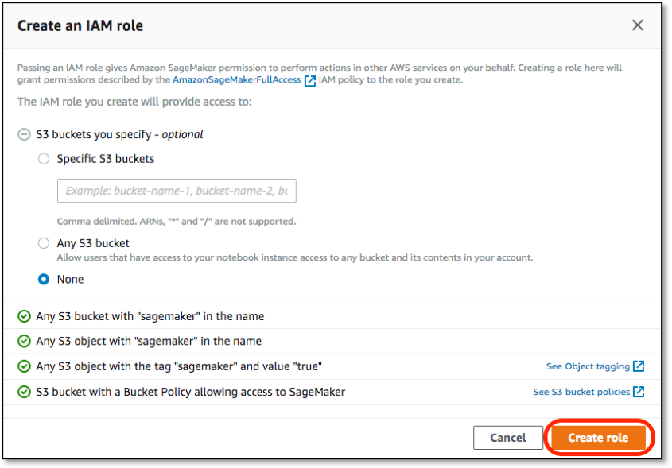

6. This will display a success message for the creation of the new role.  Leaving everything else at their default values – _Elastic inference_, _VPC_, _Lifecycle configuration_, _Encryption_ and _Volume Size_ – and click on **Create notebook instance** at the bottom of the screen.  This will launch a p2.xlarge instance running the Amazon Deep Learning AMI

# Launching the Jupyter Notebook Instance

1. Make sure that the server status is **InService**. This will take a few minutes once the creation process has started.

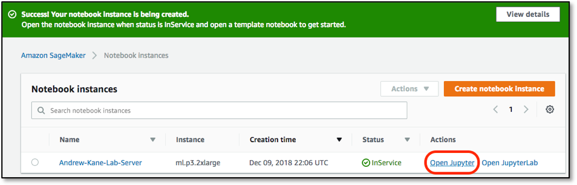

2. Click **Open Jupyter**. You now have access to the Jupyter Notebok.
3. We are going to log on to the server by launching a terminal console. Click **New** and select **Terminal.** This will open up the terminal on a new browser tab.

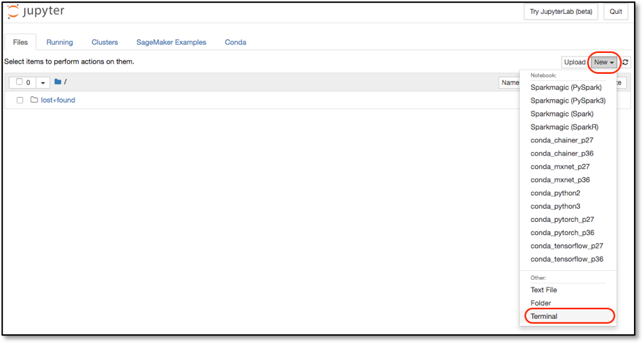

4. To download all the lab files and supporting file execute the following commands

```bash
cd sample-notebooks/
wget wget https://s3.amazonaws.com/sa-imd/sa_ml_lab.tar.gz
```

5. Once the download is complete, extract the files by typing

```bash
tar xf sa_ml_lab.tar.gz
```

6. Close this window, go to the previous browser tab, and click on the **SageMaker Examples** tab.  Scroll down to the **MI Labs** section.  You should now see the following 3 note books available for use:

- Sentiment\_MLP\_MXNet.ipynb
- Sentiment\_CNN\_MXNet.ipynb
- time-series-lstm.ipynb

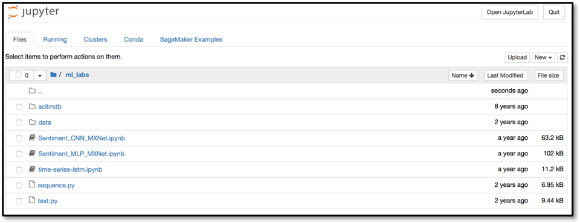

7. We will start by looking at the notebook for Sentiment Analysis using Convolutional Neural Networks in the MXNet framework _Sentiment\_CNN\_MXNet.ipynb_.  Click on the **Preview** button to preview the entire lab in a new window, but click the **Use** button to activate it.

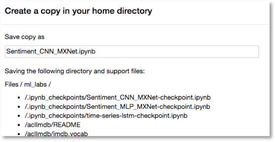

8. A dialog will appear that will show a long list of files to be copied – scroll down and click the **Create copy** button. This will automatically open this notebook.

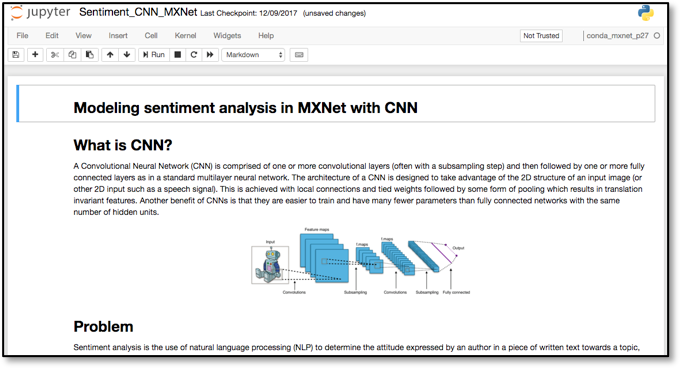

9. Switch back to the previous window and select the **Files** tab, then the **ml\_labs\_{date}** folder that the previous step created.  This will show that all 3 notebooks have been downloaded, along with all associated data, but that only the Convolutional Neural Network notebook is open.  If you select the other two then they will be opened in their own window.

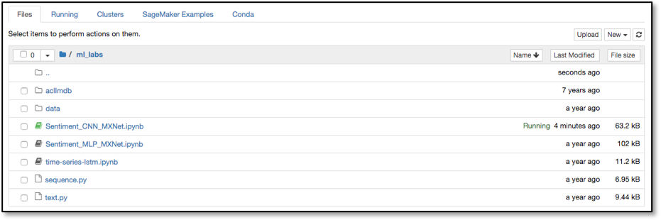

10. Go to the Convolutional Neural Network tab and change the kernel to _&quot;Environment (conda\_mxnet\_p27)&quot;._

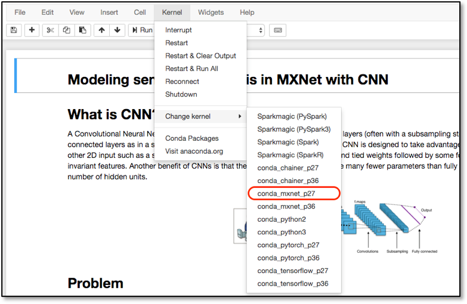

# Working Through the Jupyter Notebook Lab

1. You can now work through the notebook lab.  A notebook consisted of a number of cells; in SageMaker these will typically either be _Code_ or _Markdown_ cell.  Markdown is used to allow for documentation to be defined inline with the code, giving the author a rich set of markdown formatting options.  The first few cells in this notebook are Markdown, and if you select one then the whole cell is highlighted.

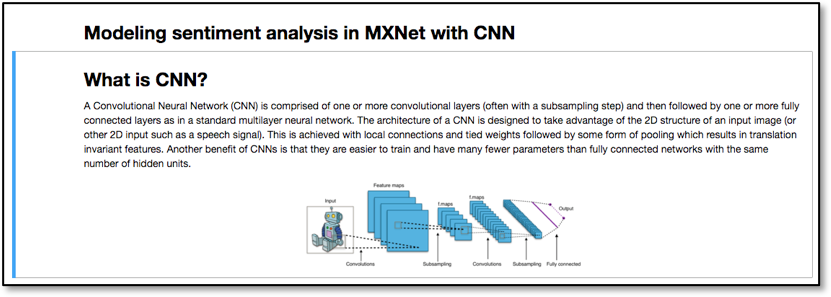

2. After scrolling past the introduction to the lab you will find the first Code cell, which is called **Load Modules**.  The previous Markdown cells ought to have described what this next Code cell is going to do – for the sake of this lab you do not have to understand the code that is being run in the Code cell, rather you should just appreciate what the notebook is doing and how you interact with a Jupyter notebook.

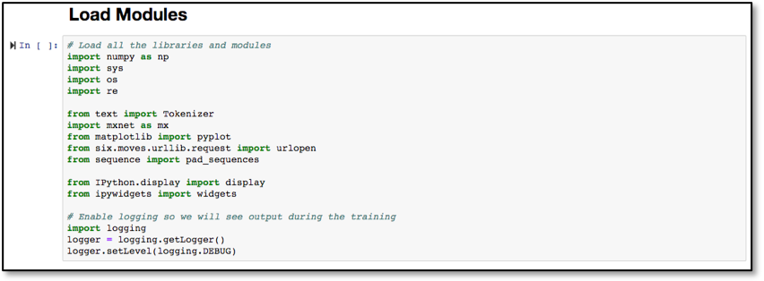

3. To the left of the Code module is a _Play_ icon, along with a set of empty braces (&#39;[]&#39;).  By clicking the _Play_ icon, or selecting the _Run_ command in the menu bar, the Jupyter notebook will execute this code, outputting and code outputs to the notebook screen and keeping any results data internally for re-use in future steps.
4. Click on the _Play_ icon to execute this Code cell.  Whilst the code is executing the braces will change to be **[\*]**, indicating that it is executing, and once complete will change to **[1]**.  Future cells will have increasing numbers inside the braces, so the braces after the execution of the second Code cell, _Process Movie Review Data_, shows as **[2]**.


5. Note, as subsequent cells use the processing results of the previous cells, you should not start to execute a cell until its predecessor has completed.  Also, please be aware that re-running previous code cells will almost certainly invalidate all future cells, so you will have to re-run those as well.
6. You will see at code cell 3, _Data Summarization_, that the code cell can take advantage of any other in-language features – in this case it will use the Python library **pyplot** to output a simple plot showing the distribution of review word lengths.

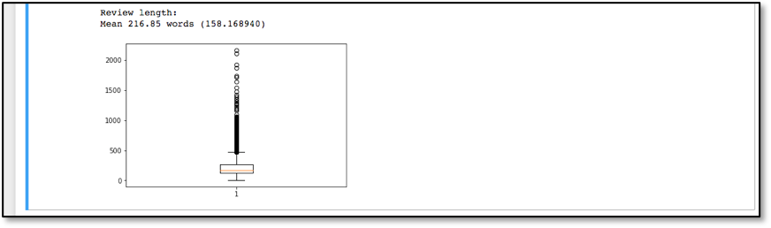

7. In cell 6, _Build a CNN Network_, you are instructed to edit the code – this shows one of the powerful features of Jupyter, as Data Scientists are able edit, update and otherwise evolve their algorithms and parameters on-the-fly within the notebook.
8. Continue through to cell 7, _Model Training_ – with an **ml.p3.2xlarge** instance type this will take around 2 minutes, longer if you use a **c5** or **m5** instance type.  The training algorithm will run through 10 iterations – or _epochs_ – of the training algorithm.  After a few epochs of progress have been output you will be able to estimate the time to completion.  Eventually, you will have values for training and validation accuracy.

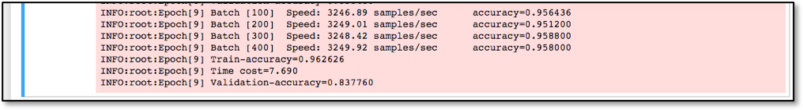

9. We save the trained model, and complete up to Coding cell 11 – we are now ready for some interactive testing.  The _Input Screen for Model Testing_ Code cell can be run multiple times – each time it will show a dialog, asking you enter a movie review paragraph and to hit the **Predict Sentiment** button – it will then give you its probability score estimate for this being a review with positive or negative sentiment.  Type in your own reviews, or use one of the four example reviews in the previous Markdown cell.

# Terminating the Notebook Instance

1. Open the Amazon SageMaker console [https://console.aws.amazon.com/sagemaker/](https://console.aws.amazon.com/sagemaker/)  and click on **Notebook instances**
2. Find the notebook instance listed as _[First Name]-[Last Name]-Lab-Server_, select its radio button and then click the **Actions** dropdown.

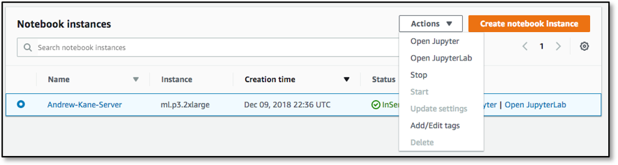

3. Click **Stop** to stop the Notebook Instance.  This does not delete the underlying data and resources, and once the instance status has changed to _Stopped_ you can click on the **Actions** dropdown again, but this time select **Delete**.

Note that by selecting the name of the Notebook instance on this dialog you are taken to a more detailed information page regarding that instance, which also has **Stop** and **Delete** buttons present – notebooks can also be deleted using this method.