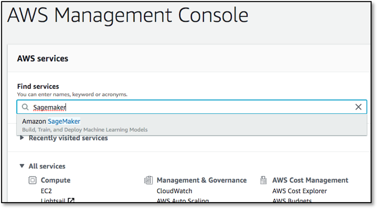

    
**Last Updated:** March 2019
# Personalize Your Recommendations

```bash
'NOTE' this lab has been designed for Amazon Personalize whilst it was still in Preview; this means that you cannot interact with the service unless your AWS account has been explicitly whitelisted.  Soon after the service becomes 'Generally Available' the lab guide will be updated so that it can run in your own AWS account rather than via the AWS Event Engine system.
```

## Overview

Amazon Personalize is a machine learning service that makes it easy for developers to create individualized recommendations for customers using their applications.

Machine learning is being increasingly used to improve customer engagement by powering personalized product and content recommendations, tailored search results, and targeted marketing promotions. However, developing the machine-learning capabilities necessary to produce these sophisticated recommendation systems has been beyond the reach of most organizations today due to the complexity of developing machine learning functionality. Amazon Personalize allows developers with no prior machine learning experience to easily build sophisticated personalization capabilities into their applications, using machine learning technology perfected from years of use on Amazon.com.

This lab will walk you through the following:

- Setting up a Jupyter Notebook environment for the Amazon Personalize Service Preview
- Downloading and preparing training data, based on the Movie Lens data set
- Importing prepared data into Amazon Personalize
- Building an ML model based upon the Hierarchical Recurrent Neural Network algorithm (HRNN)
- Testing your model by deploying an Amazon Personalize campaign

# Setup your Jupyter Notebook environment

## Launching a Jupyter Notebook using Amazon SageMaker

1. Sign into the AWS Management Console via the AWS Event Engine [https://dashboard.eventengine.run/](https://dashboard.eventengine.run/)

2. In the dialog enter your lab "hash" key and click **Proceed**


3. In the User Dashboard screen click on **AWS Console**, and in the Console Login screen click on the **Open Console** link.  For this lab you do not need to copy the credentials, as all API access is being done from within an Amazon SageMaker environment.


4. Click on **Amazon SageMaker** from the list of all services.  This will bring you to the Amazon SageMaker console homepage.  In another browser tab navigate to the **IAM** console homepage, as we'll need that shortly.



5. To create a new Jupyter notebook instance, go to **Notebook instances** in the Amazon SageMaker console, and click the **Create notebook instance** button at the top of the browser window.


4. Type _[Name]-lab-notebook_ into the **Notebook instance name** text box, and then _ml.m5.2xlarge_ into **the Notebook instance type**.  Note, for this lab the majority of the work is performed by the Amazon Personalize service, so there is not need to launch a large, compute-optimized C5 or GPU-based instance type.

5. Head over to the IAM console page that you opened earlier, and in the **Search IAM** box on the top-left enter **TeamRole** and select the role in the search results list.


6. Hit the clipboard icon to the right of the **Role ARN** line at the top of the form to copy the full ARN into the copy buffer.  Head back to the **SageMaker** window where you have part-created a notebook.  In the _IAM role_ field in **Permissions and encryption** section choose _Enter a custom IAM role ARN_ and paste the _TeamRole_ ARN into the box below.  Note that your ARN will have a different account number from that shown.


7. Scroll down and click on **Create Notebook Instance**.  Wait the notebook instance status is **InService**. This will take a few minutes once the creation process has started.  Then click on **Open Jupyter**


### Downloading required additional files

We need to download two files before starting work, which are all stored within the Lab's Git repository:

- the Notebook file that contains the lab - **personalize_sample_notebook.ipynb**
- a file that is part of the MovieLens dataset that has been edited slightly to remove some control characters that cause on of the _pandas_ library calls to fail - **u.item**

1. Go to the Git repository address, https://github.com/drandrewkane/AI_ML_Workshops, navigate to the **Lab 6** and download the two files called **u.item** and **personalize_sample_notebook.ipynb** respectively.  Use any method that you are comfortable with, such as cloning the whole repository, or opening the files within Git and download them **CHECK THIS WORKS!!!**
2. In the notebook click on the **Upload** button, and in the dialog select the two files from the location that you stored them and upload them.


3. Click on each of the two **Upload** buttons to actually upload the files, waiting for the first to complete before starting the second.


4. Once both are upload you can click on the notebook **.ipynb** file and the lab notebook will open, and you can now begin to work through the lab notebook.

### Working Through a Jupyter Notebook

1. A notebook consisted of a number of cells; in SageMaker these will typically either be _Code_ or _Markdown_ cells.  Markdown is used to allow for documentation to be defined inline with the code, giving the author a rich set of markdown formatting options.  The first cell in this notebook, which is called **Get the Personalize boto3 Client**, is Markdown, and if you select any cell then the whole cell is highlighted.


2. The first Markdown cell describes what the following Code cell is going to do – for the sake of this lab you do not have to understand the code that is being run in the Code cell, rather you should just appreciate what the notebook is doing and how you interact with a Jupyter notebook.


3. To the left of a Code module is a set of empty braces **[ ]**.  By highlighting the cell and then selecting the _Run_ command in the menu bar, the Jupyter notebook will execute this code, outputting and code outputs to the notebook screen and keeping any results data internally for re-use in future steps

4. Whilst the code is executing the braces will change to be **[\*]**, indicating that it is executing, and once complete will change to **[1]**.  Future cells will have increasing numbers inside the braces, and this helps you see the order in which cells have been exected within the notebook.  Directly below the code, but still within the Code cell, is the output from the code execution - this will include any error messages that your code has thrown.


5. Now please continue to work through the notebook lab - read the comments prior to each Code cell in order to get an understanding as to what is going on, as these explain why we are doing each step and how it ties in to using the Amazon Personalize service.

## Terminating the Notebook Instance

1. Open the Amazon SageMaker console and click on **Notebook instances**
2. Find the notebook instance listed as _[Name]-lab-notebook_, select its radio button and then click the **Actions** dropdown.


3. Click **Stop** to stop the Notebook Instance.  This does not delete the underlying data and resources.  After a few minutes the instance status will change to _Stopped_, and you can now click on the **Actions** dropdown again, but this time select **Delete**.

Note that by selecting the name of the Notebook instance on this dialog you are taken to a more detailed information page regarding that instance, which also has **Stop** and **Delete** buttons present – notebooks can also be deleted using this method.

## Conclusion

Upon completion of this lab you will have performed the following:

- Launched a Jupyter notebook from with the Amazon SageMaker service
- Imported external files into the notebook environment
- Seen how to enable Preview services within a notebook (assuming your account has been whitelisted for Preview access)
- Used the **pandas** libraries to do some pre-processing of the source data
- Built and deployed an ML model based upon the HRNN algorithm
- Tested your model via just a few lines of code

You should now be able to embed this model from within your own application code, using any language that is supported by the AWS SDK.  Happy recommending!
